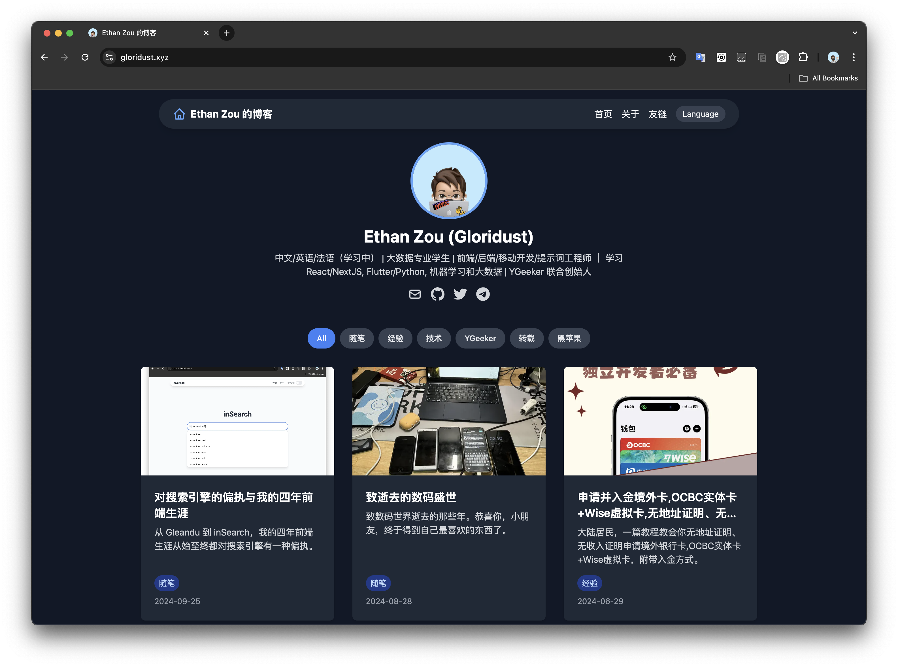

# EthanBlog

<p align="center">
  <a href="#">
    
  </a>
</p>
<h2 align="center">EthanBlog</h2>

<div align="center"><p><a href="./README.md">简体中文</a>|<a href="./README_EN.md">English(US)</a></p></div>

EthanBlog is an open-source blog system based on NextJS, using Markdown format. It supports both Chinese and English languages, features a dark mode, and includes **blog, about, and friends** pages. It can be deployed with one click using Vercel.

<p align="center">
    
</p>

## Structure

### Blog

- Article directory: [src/posts/](src/posts/)
- Article images: [public/images/posts/](public/images/posts/)

The header format for Markdown files is as follows:

```markdown
---
title: My Four Years of Frontend Career, Obsession with Search Engines
tags: Essay
date: 2024-9-25  
img: /images/posts/2024-09-25/inSearch-webui.jpg
describe: From Gleandu to inSearch, my four years of frontend career have always been obsessed with search engines.
language: en
---
```

For Chinese articles, the `language` field can be omitted, but English articles must include `language:en` to be properly categorized.

### About

The About page is edited in Markdown and supports both Chinese and English:

- Chinese: [src/content/zh/about.md](src/content/zh/about.md)
- English: [src/content/en/about.md](src/content/en/about.md)

You can also change the banner image for the About page: [public/images/about-banner.jpg](public/images/about-banner.jpg)

### Friends

The Friends page is written in JSON format within a TSX file: [src/pages/friends.tsx](src/pages/friends.tsx). It also supports multiple languages. The format is as follows:

```json
[
    {
      name: "Rene Wang",
      avatar: "/images/friends/ReneWang.png",
      description: {
        zh: "全栈开发大佬，天才少年，...",
        en: "Full-stack developer, genius, ..."
      },
      link: "https://rene.wang"
    },
    {
      name: "Charles Su",
      avatar: "/images/friends/CharlesSu.jpg",
      description: {
        zh: "乐于折腾，擅长刷机、黑苹果...",
        en: "Tech enthusiast, expert in custom ROMs, Hackintosh..."
      },
      link: "https://charles.su"
    },
    {
      name: "YGeeker",
      avatar: "/images/friends/YGeeker.png",
      description: {
        zh: "创业公司，我在此担任联合创始人",
        en: "Start-up company. I serve as a co-founder here. "
      },
      link: "https://ygeeker.com"
    },
]
```

## Debugging

0. This blog uses yarn for package management. If you don't have yarn, please install it first.

1. Fork the repository and clone it locally:

```bash
git clone https://github.com/Gloridust/ethanblog.git
cd ./ethanblog
```

2. Initialize the project and install the required dependencies:

```bash
yarn
```

3. Start debugging:

```bash
yarn dev
```

You can now debug the blog at `localhost:3000` or another available port.

## Deployment

We recommend using [Vercel](https://vercel.com/new/) for one-click deployment.

## Open Source and Contributions

This project is open-sourced under the `MIT` license. We welcome all issues and PRs to help improve this project together!